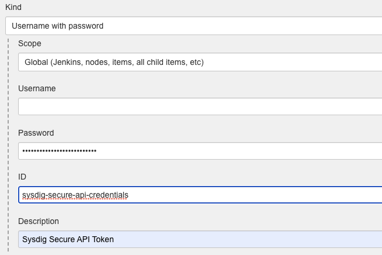
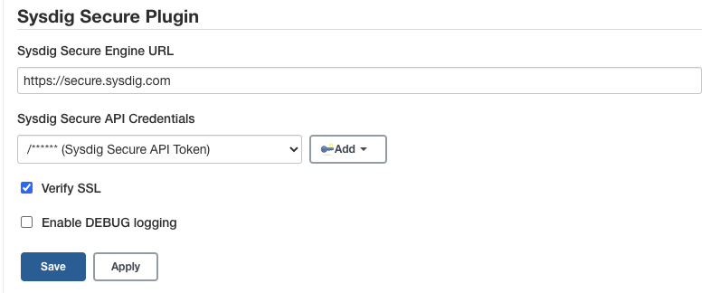
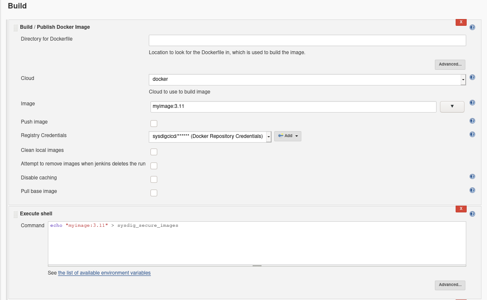
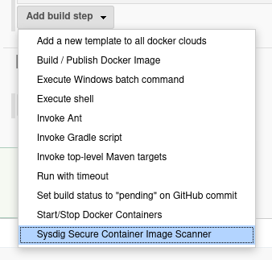
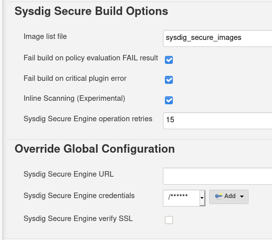
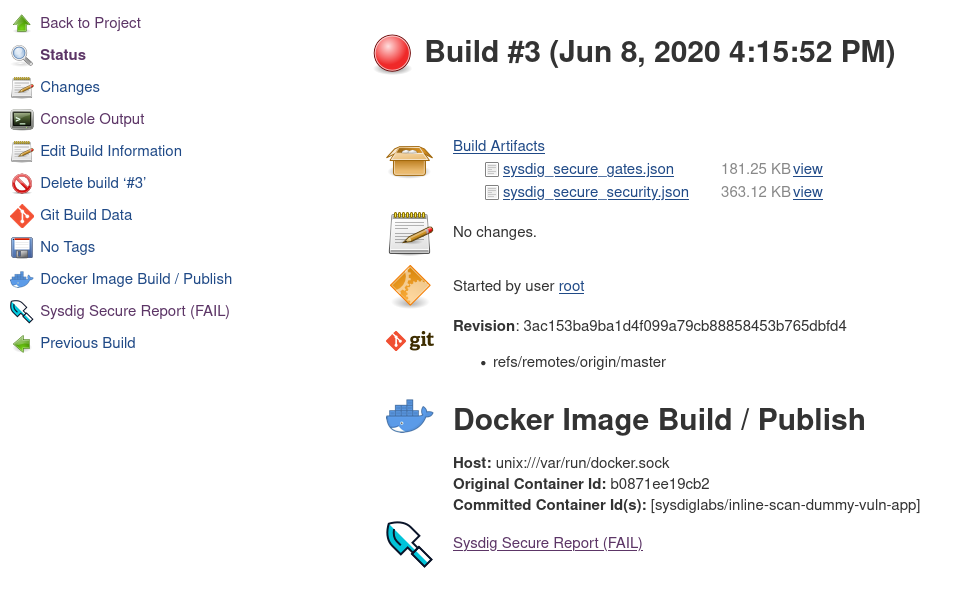
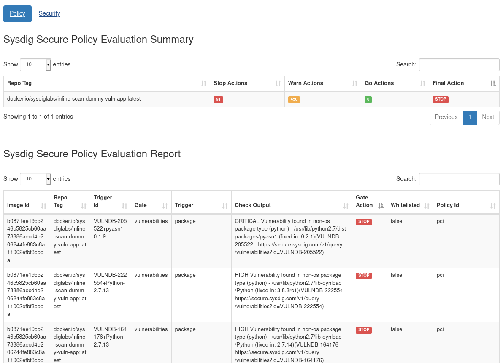

# Sysdig Secure Jenkins Plugin


[Sysdig Secure](https://sysdig.com/products/secure/) is a container
security platform that brings together Docker image scanning and
run-time protection to identify vulnerabilities, block threats, enforce
compliance, and audit activity across your microservices. The Sysdig
Secure Jenkins plugin can be used in a Pipeline job, or added as a build
step to a Freestyle job to automate the process of running an image
analysis, evaluating custom policies against images, and performing
security scans.

Table of Contents
=================

- [Getting Started](#getting-started)
  * [Backend scanning or Inline scanning](#backend-scanning-or-inline-scanning)
    + [Backend Scanning](#backend-scanning)
    + [Inline Scanning](#inline-scanning)
  * [Pre-requisites](#pre-requisites)
  * [Installation](#installation)
  * [Configuration](#configuration)
- [Images file](#images-file)
- [Example 1: Integrate the Sysdig Secure Plugin with a Freestyle Project](#example-1-integrate-the-sysdig-secure-plugin-with-a-freestyle-project)
- [Example 2: Executing the Sysdig plugin inside a pipeline](#example-2-executing-the-sysdig-plugin-inside-a-pipeline)
- [Configuration Options](#configuration-options)
- [Plugin outputs](#plugin-outputs)
- [Local development and installation](#local-development-and-installation)                                                                                                                             


# Getting Started

## Backend scanning or Inline scanning

The Sysdig Secure plugin supports two different operation modes:
* **Backend Scanning**: Image scanning happens in the Sysdig Secure Backend
* **Inline Scanning**: Image scanning happens in the Jenkins worker nodes

### Backend Scanning

PRO:
* Jenkins workers do not need to communicate with the host-local Docker daemon

CON:
* Sysdig Secure Backend needs to have network visibility in order to fetch and scan the images during the pipeline

### Inline Scanning

PRO:
* No need to configure registry credentials in the Sysdig Secure Backend
* No need to expose your registry externally, so it can be reached by Sysdig Secure (see CON in the section above)
* Image contents are never transmitted outside the pipeline, just the image metadata

CON:
* The job performing the inline scanning needs to have access to the host-local Docker daemon

## Pre-requisites
## Pre-requisites

Both modes require a valid [Sysdig Secure API token](https://docs.sysdig.com/en/find-the-super-admin-credentials-and-api-token.html#al_UUID-be84a2f1-b996-c30c-b5d8-5b8e4663146a_UUID-87bc65c6-ef79-6225-3910-39f619617a2c)

For Backend mode, the Sysdig Backend (SaaS or Onprem) needs to be able to fetch the images produced by this pipeline, usually accessing a buffer Docker repository.

For Inline mode, Jenkins workers need to have access to the host-local Docker daemon, in the most common case, by mounting or linking the Docker socket. The Jenkins worker user needs to be able to read and write the socket.

## Installation

The Sysdig Secure plugin is published in the Jenkins plugin registry,
and is available for installation on any Jenkins server.

1.  <https://github.com/jenkinsci/sysdig-secure-plugin>

## Configuration

To configure the Sysdig Secure plugin:

1.  Complete these steps after installing the hpi file from the installation link above.
2.  From the main Jenkins menu, select `Manage Jenkins`.
3.  Click the `Configure System` link.  
    
4.  Scroll to the `Sysdig Secure Plugin Mode` section.
5.  Create a new credential containing the Sysdig API key found here (You just need to fill the password field): <https://secure.sysdig.com/#/settings/user>

    
    
6.  Configure the Sysdig Backend URL, `https://api.sysdigcloud.com` if you are using SaaS or your own if you are using an on-prem installation, and select the previously created credential.

    Mark the Inline scanning option in case you have decided to use Inline scanning:

    
    
7.  Click `Save`.

# Images file

The Sysdig Secure plugin reads a file called `sysdig_secure_images` (by default) for the list of images to scan.

This simple file follows the following format:

```
<imagename1> <Dockerfile path1>
<imagename2> <Dockerfile path2>
...
```
Dockerfile path is optional, can be included if we want to forward this information to the evaluation process.

Example:

```
myimage:3.11 ./build/Dockerfile
alpine:latest 
```


# Example 1: Integrate the Sysdig Secure Plugin with a Freestyle Project

1.  Using the Jenkins Docker plugin for this example, you could start by building the image and writing the image name to the `sysdig_secure_images` file

    

2.  Open the `Add build step` drop-down menu, and select
    `Sysdig Secure Container Image Scanner`. This creates a new build
    step labeled `Sysdig Secure Build Options`.  
    
3.  Configure the available options, and click `Save`.  
    


:speech_balloon: Take into account that this example is using the Inline scanning mode, in case you want to use Backend scanning, you would need to push the image to a registry that is pulleable by the Sysdig Backend.


# Example 2: Executing the Sysdig plugin inside a pipeline

The following is a simplified example executing the Sysdig plugin as a stage inside a pipeline

```
stages {
    stage('Checkout') {
        steps {                
            checkout scm
        }
    }
    stage('Build Image') {
        steps {
            sh "docker build -f Dockerfile -t ${params.DOCKER_REPOSITORY} ."
            sh "echo ${params.DOCKER_REPOSITORY} > sysdig_secure_images"
        }
    }
    stage('Scanning Image') {
        steps {
            sysdig engineCredentialsId: 'sysdig-secure-api-credentials', name: 'sysdig_secure_images', inlineScanning: true
        }
    }
}
```

The table below describes each of the configuration options.


# Configuration Options


| Option                                 | Description                                                                                                                                                                                                                                                      | Default |
|----------------------------------------|------------------------------------------------------------------------------------------------------------------------------------------------------------------------------------------------------------------------------------------------------------------| -------|
| Image list file                        | The name of the file, present in the workspace that contains the image(s) name, and optionally the Dockerfile location.                                                                                                                                             | `sysdig_secure_images`
| Fail build on policy check STOP result | If the Sysdig Secure policy evaluate returns a fail (STOP) then the Jenkins job should be failed. If this is not selected then a failed policy evaluation will allow the build to continue.                                                                      | `true` | 
| Fail build on critical plugin error    | If selected, and the Sysdig Secure Plugin experiences a critical error, the the build will be failed. This is typically used to ensure that a fault with Sysdig Secure (eg. service not available) does not permit a failing image to be promoted to production. | `true` | 
| Inline Scanning                        | Executes the scanning in the same host where the image has been built without needing to push it to an staging registry. Requires a runner with access to the Docker socket at `/var/run/docker.sock` and read-write privileges in it. | `false` | 

The following is an example of executing the Sysdig Secure plugin as a Jenkinsfile step, modifying the default parameters

```
sysdig bailOnFail: false, bailOnPluginFail: false, engineCredentialsId: 'sysdig-secure-api-credentials', engineurl: 'https://api.sysdigcloud.com', inlineScanning: true, name: 'sysdig_secure_images'
```

# Plugin outputs

Once the scanning and evaluation is complete, you will have the following build artifacts and reports in the workspace



`sysdig_secure_gates.json` Scanning results for the Sysdig [policy evaluation](https://docs.sysdig.com/en/manage-scanning-policies.html).

`sysdig_secure_security.json` Detected vulnerability data

Additionally, the plugin offers you an HTML formatted table output that you can directly display from the interface (`Sysdig Secure Report (FAIL)` in the image above)




# Local development and installation

Use docker to build the sysdig-secure.hpi file:

```sh
docker run -it --rm --name maven-jenkins-builder -v "$(pwd)":/usr/src/app -w /usr/src/app maven:3.3-jdk-8 mvn package
```

You can then install the plugin via the Jenkins UI, or by copying it into $JENKINS_HOME/plugins.

