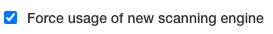
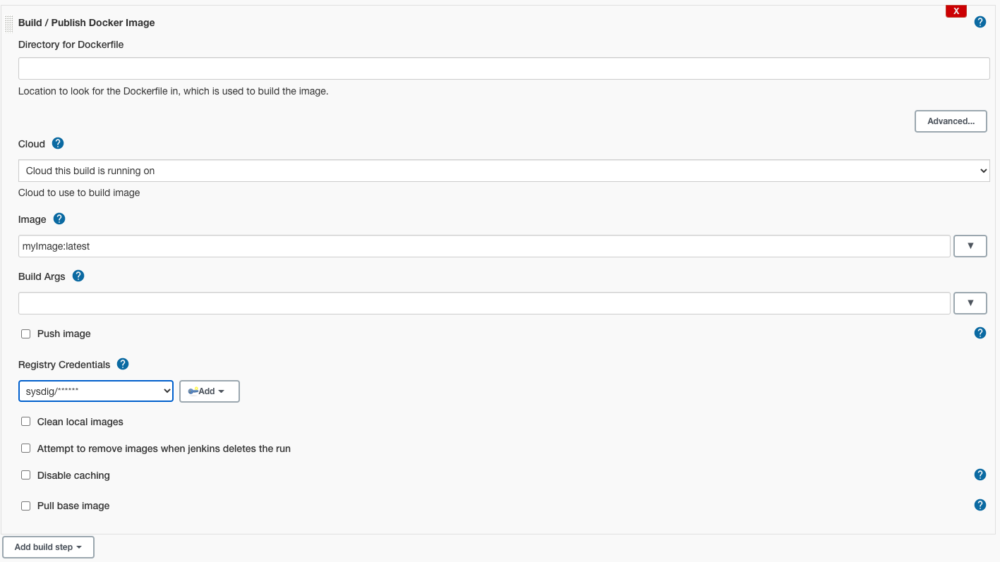
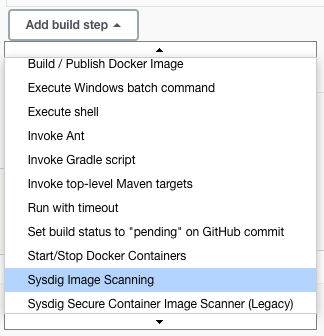
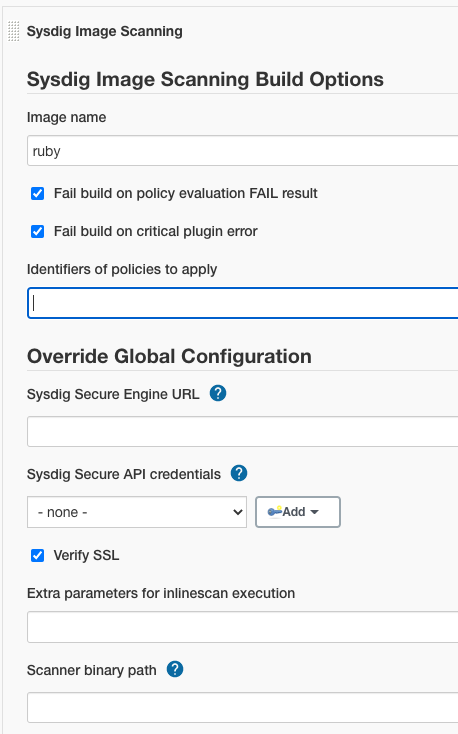
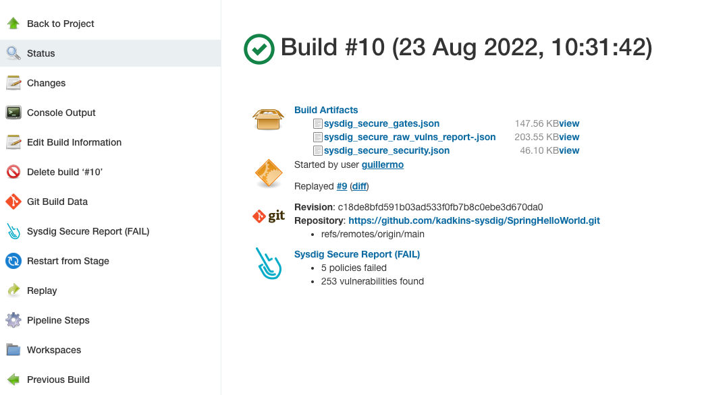
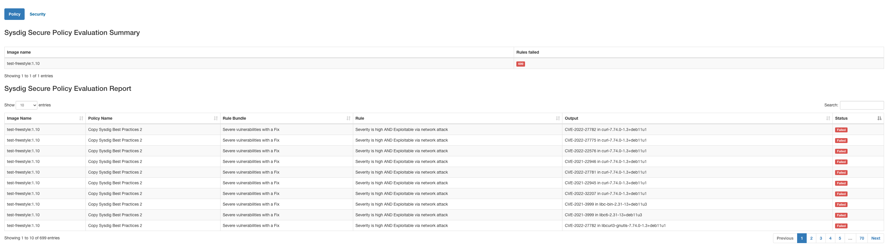

# Sysdig Secure Jenkins Plugin


[Sysdig Secure](https://sysdig.com/products/secure/) is a container security platform that brings together Docker image
scanning and run-time protection to identify vulnerabilities, block threats, enforce compliance, and audit activity
across your microservices. The Sysdig Secure Jenkins plugin can be used in a Pipeline job, or added as a build step to a
Freestyle job to automate the process of running an image analysis, evaluating custom policies against images, and
performing security scans.

> The Sysdig engine has been redesigned to provide better quality results, this documentation shows you how to configure the plugin to work with the redesigned engine.
>
>If you are still using the legacy engine please refer to the [Legacy engine plugin documentation](README-legacy.md)

# Getting Started

## Pre-requisites

Requires a
valid [Sysdig Secure API token](https://docs.sysdig.com/en/find-the-super-admin-credentials-and-api-token.html#al_UUID-be84a2f1-b996-c30c-b5d8-5b8e4663146a_UUID-87bc65c6-ef79-6225-3910-39f619617a2c)

Jenkins workers **need to have access to the image storage**, either to the local storage where the image was created or
to the registry where it is stored.

## Installation

The Sysdig Secure plugin is published as a Jenkins plugin and is available for installation on any Jenkins server using
the *Plugin Manager* in the web UI through the *Manage Jenkins > Manage Plugins* view, available to administrators of a
Jenkins environment.

See https://www.jenkins.io/doc/book/managing/plugins/

## Global configuration

### Required Config

To configure the Sysdig Secure plugin:

1. Complete these steps after installing the plugin.

2. From the main Jenkins menu, select `Manage Jenkins`.

3. Click the `Configure System` link.

   
4. Scroll down to the `Sysdig Secure Plugin` section.

5. In the `Sysdig Secure API Credentials` drop-down, click `Add` button to create a new credential containing the Sysdig
   Secure API Token that you can find in Sysdig Secure -> Settings -> User Profile. You only need to fill the password
   field and keep the user blank. Oncre created, select the new credential in the `Sysdig Secure API Credentials`
   drop-down.


6. Enter the Sysdig Secure API endpoint in the `Sysdig Secure Engine URL` field. For On-Prem installations, this is the
   URL where your Secure API is exposed. For SaaS service:

    * Default region US East (North Virginia): `https://secure.sysdig.com`
    * US West (Oregon): `https://us2.app.sysdig.com`
    * European Union: `https://eu1.app.sysdig.com`
   > Check [SaaS Regions and IP Ranges](https://docs.sysdig.com/en/saas-regions-and-ip-ranges.html) for a complete list of regions


7. If you are connecting to an On-Prem instance using an invalid TLS certificate, then you need to either configure
   Jenkins to trust the certificate, or uncheck the `Verify SSL` checkbox.

8. Click `Save`.

# Usage

## Build Step

In order to use the plugin you need to include the Sysdig Image Scanning build step either on your freestyle projects or
your pipelines. It is possible to globally enforce jobs configured with legacy build step to execute the redesigned
engine by selecting the option force usage of new scanning engine in the global configuration.



## Example 1: Integrate the Sysdig Secure Plugin with a Freestyle Project

1. Using the Jenkins Docker plugin for this example, you could start by building the image and writing the image name to
   the `sysdig_secure_images` file

    

2. Open the `Add build step` drop-down menu, and select
   `Sysdig Image Scanning`. This creates a new build step labeled `Sysdig Image Scanning Build Options`.

   
3. Configure the available options, and click `Save`.

   

## Example 2: Executing the Sysdig plugin inside a pipeline

The following is a simplified example executing the Sysdig plugin as a stage inside a pipeline

```
stages {
    stage('Checkout') {
        steps {
            checkout scm
        }
    }
    stage('Build Image') {
        steps {
            sh "docker build -f Dockerfile -t ${params.DOCKER_REPOSITORY} ."
        }
    }
    stage('Scanning Image') {
        steps {
            sysdigImageScan engineCredentialsId: 'sysdig-secure-api-credentials', imageName: "${params.DOCKER_REPOSITORY}"
        }
    }
}
```

The table below describes each of the configuration options.

## Execution options

| Option                                 | Parameter        | Description                                                                                                                                                                                                                                                  | Default |
|----------------------------------------|------------------|--------------------------------------------------------------------------------------------------------------------------------------------------------------------------------------------------------------------------------------------------------------| ----- |
| Image name                             | ImageName        | The name of the image to scan                                                                                                                                                                                                                                | `sysdig_secure_images` |
| Fail build on policy check STOP result | bailOnFail       | If the Sysdig Secure policy evaluate returns a fail (STOP), then the Jenkins job should be failed. If this is not selected then a failed policy evaluation will allow the build to continue.                                                                 | `true` |
| Fail build on critical plugin error    | bailOnPluginFail | If selected, and the Sysdig Secure Plugin experiences a critical error, the build will be failed. This is typically used to ensure that a fault with Sysdig Secure (eg. service not available) does not permit a failing image to be promoted to production. | `true` |
| Identifiers of policies to apply       | policiesToApply   | List of policies to apply to the image in addition to those marked as always apply in the sysdig ui                                                                                                                                                          | |

The following is an example of executing the Sysdig Secure plugin as a Jenkinsfile step, modifying the default
parameters

```
sysdigImageScan bailOnFail: false, bailOnPluginFail: false, engineCredentialsId: 'sysdig-secure-api-credentials', engineURL: 'https://secure.sysdig.com', engineVerify: false, imageName: 'ruby', policiesToApply: 'foo', scannerBinaryPath: '/bin/sysdig-cli-scanner'
```

# Plugin outputs

Once the scanning and evaluation is complete, you will have the following build artifacts and reports in the workspace



`sysdig_secure_gates.json` Scanning results for the
Sysdig [policy evaluation](https://docs.sysdig.com/en/manage-scanning-policies.html).

`sysdig_secure_security.json` Detected vulnerability data

`sysdig_secure_raw-vulns_report-.json` Raw vulnerability data

Additionally, the plugin offers you an HTML formatted table output that you can directly display from the
interface (`Sysdig Secure Report (FAIL)` in the image above)



# Local development and installation

Use docker to build the sysdig-secure.hpi file:

```sh
docker run -it --rm --name maven-jenkins-builder -v "$(pwd)":/usr/src/app -w /usr/src/app maven:3.6.3-jdk-8 mvn package
```

You can then install the plugin via the Jenkins UI, or by copying it into $JENKINS_HOME/plugins.
