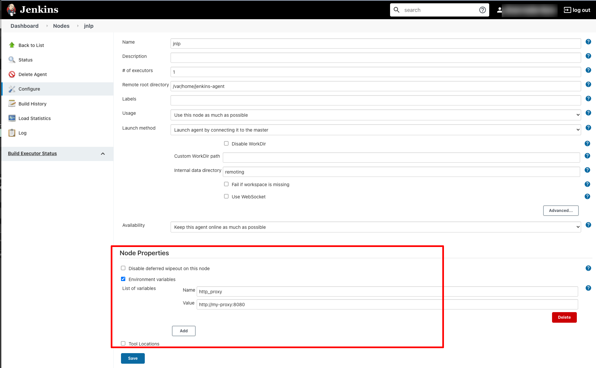
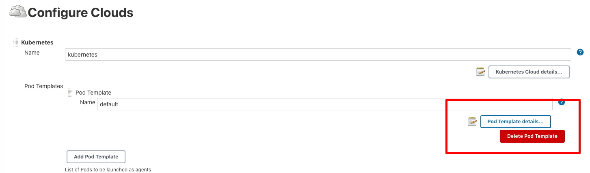
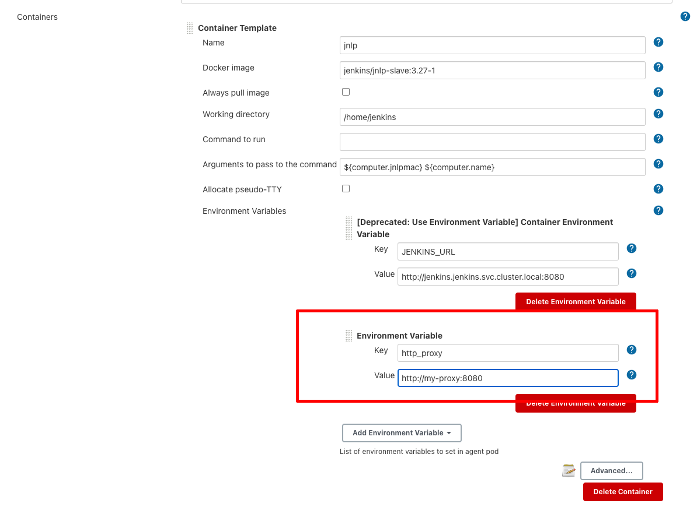

# Sysdig Secure Jenkins Plugin


[Sysdig Secure](https://sysdig.com/products/secure/) is a container
security platform that brings together Docker image scanning and
run-time protection to identify vulnerabilities, block threats, enforce
compliance, and audit activity across your microservices. The Sysdig
Secure Jenkins plugin can be used in a Pipeline job, or added as a build
step to a Freestyle job to automate the process of running an image
analysis, evaluating custom policies against images, and performing
security scans.

Table of Contents
=================

- [Sysdig Secure Jenkins Plugin](#sysdig-secure-jenkins-plugin)
- [Table of Contents](#table-of-contents)
- [Getting Started](#getting-started)
  - [Backend scanning or Inline scanning](#backend-scanning-or-inline-scanning)
    - [Backend Scanning](#backend-scanning)
    - [Inline Scanning](#inline-scanning)
  - [Pre-requisites](#pre-requisites)
  - [Installation](#installation)
  - [Configuration](#configuration)
- [Images file](#images-file)
- [Example 1: Integrate the Sysdig Secure Plugin with a Freestyle Project](#example-1-integrate-the-sysdig-secure-plugin-with-a-freestyle-project)
- [Example 2: Executing the Sysdig plugin inside a pipeline](#example-2-executing-the-sysdig-plugin-inside-a-pipeline)
- [Configuration Options](#configuration-options)
- [Proxy configuration](#proxy-configuration)
  - [Backend scan](#backend-scan)
  - [Inline scan](#inline-scan)
  - [Docker connection configuration](#docker-connection-configuration)
    - [Inline-scan container image override (air-gapped environments)](#inline-scan-container-image-override-air-gapped-environments)
- [Configuring environment variables in workers](#configuring-environment-variables-in-workers)
  - [Static agent configuration](#static-agent-configuration)
  - [Kubernetes cloud configuration (pod templates)](#kubernetes-cloud-configuration-pod-templates)
- [Plugin outputs](#plugin-outputs)
- [Local development and installation](#local-development-and-installation)

# Getting Started

## Backend scanning or Inline scanning

The Sysdig Secure plugin supports two different operation modes:
* **Backend Scanning**: Image scanning happens in the Sysdig Secure Backend
* **Inline Scanning**: Image scanning happens in the Jenkins worker nodes

### Backend Scanning

PRO:
* Jenkins workers do not need to communicate with the host-local Docker daemon

CON:
* Sysdig Secure Backend needs to have network visibility in order to fetch and scan the images during the pipeline

### Inline Scanning

PRO:
* No need to configure registry credentials in the Sysdig Secure Backend
* No need to expose your registry externally, so it can be reached by Sysdig Secure (see CON in the section above)
* Image contents are never transmitted outside the pipeline, just the image metadata

CON:
* The job performing the inline scanning needs to have access to the Docker daemon

## Pre-requisites

Both modes require a valid [Sysdig Secure API token](https://docs.sysdig.com/en/find-the-super-admin-credentials-and-api-token.html#al_UUID-be84a2f1-b996-c30c-b5d8-5b8e4663146a_UUID-87bc65c6-ef79-6225-3910-39f619617a2c)

For Backend mode, the Sysdig Backend (SaaS or Onprem) needs to be able to fetch the images produced by this pipeline, usually accessing a buffer Docker repository.

For Inline mode, Jenkins workers need to have access to the Docker daemon, in the most common case, by mounting or linking the Docker socket or connecting as specified by DOCKER_HOST environment variable. The Jenkins worker user needs to be able to read and write the socket, and for TCP connections TLS and certificated might be required, depending on the daemon configuration.

## Installation

The Sysdig Secure plugin is published as a Jenkins plugin and is available for installation on any Jenkins server
using the *Plugin Manager* in the web UI through the *Manage Jenkins > Manage Plugins* view, available to
administrators of a Jenkins environment.

See https://www.jenkins.io/doc/book/managing/plugins/

## Configuration

To configure the Sysdig Secure plugin:

1.  Complete these steps after installing the hpi file from the installation link above.
2.  From the main Jenkins menu, select `Manage Jenkins`.
3.  Click the `Configure System` link.  
    
4.  Scroll to the `Sysdig Secure Plugin` section.
5.  Create a new credential containing the Sysdig API key found here (You just need to fill the password field): <https://secure.sysdig.com/#/settings/user>

    
    
6.  Configure the Sysdig Backend URL, `https://secure.sysdig.com` if you are using SaaS or your own if you are using an on-prem installation, and select the previously created credential.

    Mark the Inline scanning option in case you have decided to use Inline scanning:

    
    
7.  Click `Save`.

# Images file

The Sysdig Secure plugin reads a file called `sysdig_secure_images` (by default) for the list of images to scan.

This simple file follows the following format:

```
<imagename1> <Dockerfile path1>
<imagename2> <Dockerfile path2>
...
```
Dockerfile path is optional, can be included if we want to forward this information to the evaluation process.

Example:

```
myimage:3.11 ./build/Dockerfile
alpine:latest 
```

# Example 1: Integrate the Sysdig Secure Plugin with a Freestyle Project

1.  Using the Jenkins Docker plugin for this example, you could start by building the image and writing the image name to the `sysdig_secure_images` file

    

2.  Open the `Add build step` drop-down menu, and select
    `Sysdig Secure Container Image Scanner`. This creates a new build
    step labeled `Sysdig Secure Build Options`.  
    
3.  Configure the available options, and click `Save`.  
    

:speech_balloon: Take into account that this example is using the Inline scanning mode, in case you want to use Backend scanning, you would need to push the image to a registry that is pulleable by the Sysdig Backend.


# Example 2: Executing the Sysdig plugin inside a pipeline

The following is a simplified example executing the Sysdig plugin as a stage inside a pipeline

```
stages {
    stage('Checkout') {
        steps {                
            checkout scm
        }
    }
    stage('Build Image') {
        steps {
            sh "docker build -f Dockerfile -t ${params.DOCKER_REPOSITORY} ."
            sh "echo ${params.DOCKER_REPOSITORY} > sysdig_secure_images"
        }
    }
    stage('Scanning Image') {
        steps {
            sysdig engineCredentialsId: 'sysdig-secure-api-credentials', name: 'sysdig_secure_images', inlineScanning: true
        }
    }
}
```

The table below describes each of the configuration options.

# Configuration Options

| Option                                 | Description                                                                                                                                                                                                                                                      | Default |
|----------------------------------------|------------------------------------------------------------------------------------------------------------------------------------------------------------------------------------------------------------------------------------------------------------------| -------|
| Image list file                        | The name of the file, present in the workspace that contains the image(s) name, and optionally the Dockerfile location.                                                                                                                                             | `sysdig_secure_images`
| Fail build on policy check STOP result | If the Sysdig Secure policy evaluate returns a fail (STOP) then the Jenkins job should be failed. If this is not selected then a failed policy evaluation will allow the build to continue.                                                                      | `true` | 
| Fail build on critical plugin error    | If selected, and the Sysdig Secure Plugin experiences a critical error, the the build will be failed. This is typically used to ensure that a fault with Sysdig Secure (eg. service not available) does not permit a failing image to be promoted to production. | `true` | 
| Inline Scanning                        | Executes the scanning in the same host where the image has been built without needing to push it to an staging registry. Requires a runner with access to the Docker socket at `/var/run/docker.sock` and read-write privileges in it. | `false` | 

The following is an example of executing the Sysdig Secure plugin as a Jenkinsfile step, modifying the default parameters

```
sysdig bailOnFail: false, bailOnPluginFail: false, engineCredentialsId: 'sysdig-secure-api-credentials', engineurl: 'https://secure.sysdig.com', inlineScanning: true, name: 'sysdig_secure_images'
```

# Proxy configuration

## Backend scan

Backend scan connects to Sysdig Secure backend from the Jenkins master node, so it will use the [Jenkins proxy configuration](https://wiki.jenkins.io/display/JENKINS/JenkinsBehindProxy).

## Inline scan

Inline scan is executed in the worker node, so proxy is configured with the standard environment variables `http_proxy`, `https_proxy` and `no_proxy`.

Environment variables must be defined in **the worker node**. See *Configuring environment variables in workers* section.

## Docker connection configuration

Connection to the Docker daemon uses the FIFO socket at /var/run/docker.sock by default, but you can use the following standard Docker environment variables to override the default connection:

* DOCKER_HOST: Daemon socket to connect to. i.e. `unix:///var/run/docker.sock` or `tcp://192.168.59.106`
* DOCKER_TLS_VERIFY: When set Docker uses TLS and verifies the remote
* DOCKER_CERT_PATH: The location of your authentication keys

See [Docker environment variables documentation](https://docs.docker.com/engine/reference/commandline/cli/#environment-variables) for more information.

Environment variables must be defined in **the worker node**. See *Configuring environment variables in workers* section.

### Inline-scan container image override (air-gapped environments)

By default, the plugin uses the image `quay.io/sysdig/secure-inline-scan:2` to execute in the inline scan. This tag points to the latest 2.x available version.

If the environment variable `SYSDIG_OVERRIDE_INLINE_SCAN_IMAGE` is set, its value will override the default inline-scan image.

This can be useful in situations where you want to use a version different to the latest 2.x, or for air-gapped environments, where the inline-scan is pulled from a private registry.

Environment variables must be defined in **the worker node**. See *Configuring environment variables in workers* section.

# Configuring environment variables in workers

## Static agent configuration

For static agents, go to *Manage Jenkins -> Manage Nodes* and select the corresponding agent, then click *Configure*.

Check *Environment variables* under *Node Properties* and define the variables in there as required, for example `http_proxy`, `https_proxy` and `no_proxy`, or `DOCKER_HOST`.



## Kubernetes cloud configuration (pod templates)

For agents using pods and containers provided by the Kubernetes cloud plugin, the environment variables are defined in the pod template.

Go to the Kubernetes plugin configuration (*Manage Jenkins -> Manage Nodes and Clouds -> Configure Clouds*).

There, check the *Pod Template details* to display the available pod templates:



Edit the desired pod template, and add the environment variables to the container where the Inline scan will run:



For pod templates defined in the pipeline, you can add the environment variables directly in the YAML:

```yaml
pipeline {
    agent {
       kubernetes {
           yaml """
apiVersion: v
kind: Pod
metadata:
    name: custom-pod
spec:
    containers:
      - name: my-worker
        image: custom-jenkins-builder:latest
        securityContext:
          privileged: true
        ...
        env:
        # Set the environment variables for the container
        - name: http_proxy
          value: http://my-proxy:8080
        - name: DOCKER_HOST
          value: tcp://didn-jenkins:2376
        - name: DOCKER_TLS_VERIFY
          value: true
        - name: DOCKER_CERT_PATH
          value: /mounted_certs
...
"""
       }
   }
```

# Plugin outputs

Once the scanning and evaluation is complete, you will have the following build artifacts and reports in the workspace


`sysdig_secure_gates.json` Scanning results for the Sysdig [policy evaluation](https://docs.sysdig.com/en/manage-scanning-policies.html).

`sysdig_secure_security.json` Detected vulnerability data

Additionally, the plugin offers you an HTML formatted table output that you can directly display from the interface (`Sysdig Secure Report (FAIL)` in the image above)


# Local development and installation

Use docker to build the sysdig-secure.hpi file:

```sh
docker run -it --rm --name maven-jenkins-builder -v "$(pwd)":/usr/src/app -w /usr/src/app maven:3.3-jdk-8 mvn package
```

You can then install the plugin via the Jenkins UI, or by copying it into $JENKINS_HOME/plugins.
